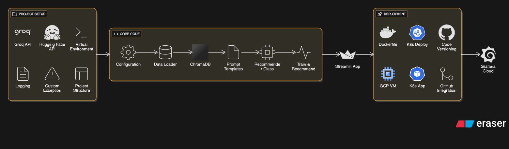

# AI-Anime-Recommender-AIOps

## Tech Stack

1. **Groq** → LLM
2. **HuggingFace** → Embedding Model
3. **Langchain** → Gen AI framework to interact with LLM
4. **GCP VM** → Virtual Machine accessible on cloud (Google Cloud service)
5. **Minikube** → Kubernetes Cluster for application deployment
6. **Streamlit** → UI/frontend framework
7. **Docker** → Application containerization
8. **Grafana Cloud** → Kubernetes Cluster monitoring
9. **Chroma DB** → Local Vector Store for embeddings
10. **Kubectl** → CLI to interact with your Kubernetes

